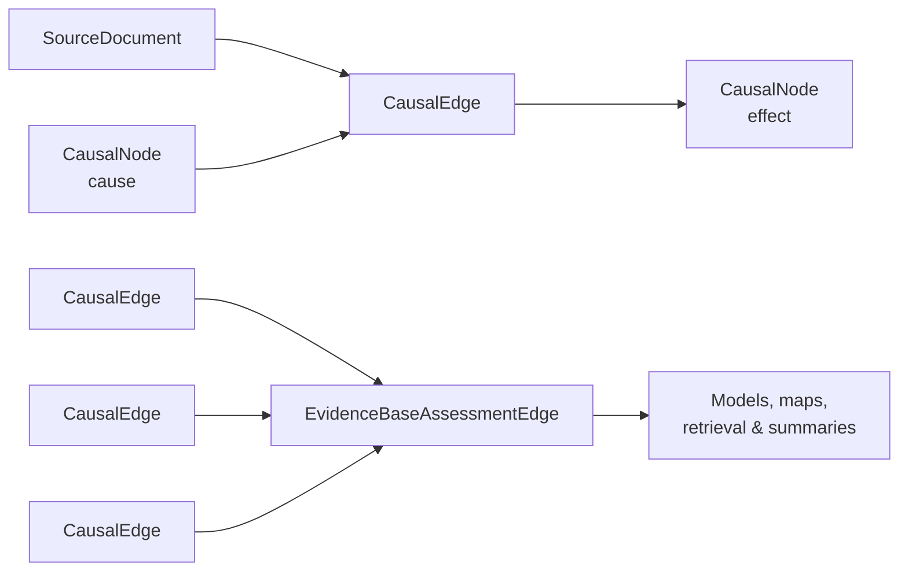

# Causal Mosaic Schema

<p align="center">
  
</p>

[](https://github.com/timalamenciak/causalmosaic/tags)
[](https://github.com/timalamenciak/causalmosaic/actions/workflows/linkml-schema.yml)

**Current schema version: 0.7.8**

The **Causal Mosaic Schema (CAMO)** is a [LinkML](https://linkml.io/) schema for representing causal claims from ecological evidence as a structured, ontology-grounded labeled property graph.

CAMO combines:

* the ecological entity pattern developed in the **Ecolink Model / ELMO**, where causally relevant variables are decomposed into an entity, measurable attribute, and state or change; and
* the **[Illari–Russo causal mosaic framework](https://global.oup.com/academic/product/causality-9780199662678)**, which treats causal inference as drawing on multiple kinds and features of evidence rather than a single universal criterion.

The goal is to annotate ecological evidence once in a rich canonical representation and then use that representation for multiple forms of synthesis, modelling, retrieval, and communication.

CAMO can support downstream construction of **causal diagrams, fuzzy cognitive maps, evidence gap maps, Bayesian belief networks, retrieval-augmented generation systems, Rosetta-style natural-language statements, and practitioner-oriented evidence summaries**.

CAMO represents evidence for these outputs; it is **not itself a causal inference or statistical modelling engine**.

---

## The schema in one sentence

CAMO represents **causally relevant ecological states and changes as nodes**, **article-level causal claims as richly annotated edges**, and **synthesis-level judgments across multiple claims as evidence-base assessment edges**.

---

## Conceptual model



CAMO separates three related things:

1. **What ecological variable or process are we talking about?**
   Represented by `CausalNode`.

2. **What causal claim did an individual source make?**
   Represented by `CausalEdge`.

3. **What does the evidence base collectively say about that relationship?**
   Represented by `EvidenceBaseAssessmentEdge`.

This separation allows the original literature annotations to remain stable while synthesis-level assessments can be regenerated as new evidence is added.

---

## Core graph objects

### `CausalGraph`

`CausalGraph` is the top-level container for a CAMO dataset.

It contains:

* `source_documents` — bibliographic and study metadata for documents contributing evidence;
* `nodes` — the ecological variables, processes, interventions, and other causally relevant states represented in the graph;
* `edges` — article-level causal claims; and
* `evidence_base_assessments` — derived assessments synthesizing multiple article-level claims.

The graph also records provenance, schema version, annotation protocol, ontology versions, and export metadata to support reproducible evidence synthesis.

---

### `CausalNode`

A `CausalNode` represents something ecologically relevant **in a causally meaningful state or change of state**.

CAMO does not generally treat a species, chemical, habitat, or process alone as the causal variable. Instead, nodes can be decomposed into:

```text
entity
  +
measured attribute
  +
state/change qualifier
  +
optional applied-to context
```

For example:

```text
Canis lupus
+ abundance
+ increased
= increased abundance of Canis lupus
```

The main structured components are:

* `entity_type` — broad category of entity;
* `entity_term` — ontology identifier or, when necessary, free text;
* `measured_attribute` — the property being measured;
* `state_or_change_qualifier` — e.g. `increased`, `decreased`, `present`, or `absent`;
* `applied_to` — structured information about the entity to which a variable, process, or intervention applies; and
* `source_spans` — text grounding the node in the source literature.

This decomposition lets CAMO distinguish, for example, *wolf abundance* from *wolf presence*, while still allowing searches across all claims involving wolves.

#### `applied_to`

`applied_to` provides additional structured context without folding that context into the node label.

For an `environmental_variable`, it can describe the taxa or ecological guilds over which a measurement is aggregated:

> increased richness **of native plants**

For an `environmental_process` or `management_intervention`, it can identify the directional target:

> herbivory **on Sphagnum**

> invasive species removal **of Alliaria petiolata**

---

### `CausalEdge`

A `CausalEdge` represents an **article-level causal claim** connecting a cause node to an effect node:

```text
subject → predicate → object
```

For example:

```text
increased wolf abundance
        ↓
     causes
        ↓
decreased deer abundance
```

The edge retains both **what relationship was claimed** and **how that claim was expressed and supported by the source**.

Each edge contains four causal-annotation layers.

#### Layer 1 — Claim strength and expression

How explicitly does the source make a causal claim?

Relevant fields include:

* `claim_strength`
* `original_sentence`
* `negated`

This distinguishes direct causal assertions from weaker or more qualified causal language.

#### Layer 2 — Philosophical accounts of causation

Which conceptions of causation are invoked by the evidence or argument?

CAMO currently represents accounts including:

* counterfactual
* probabilistic
* interventionist
* transmission
* mechanistic
* regularity
* INUS-component
* agency

A single claim may invoke more than one account.

#### Layer 3 — Causal features

CAMO records **16 features of causal relationships**:

* necessity
* sufficiency
* direction
* temporal ordering
* mediation
* moderation
* strength
* specificity
* stability
* token vs. type
* determinism
* proximate vs. distal
* contributing vs. sole cause
* reversibility
* proportionality
* context dependence

These features allow claims to be compared without forcing all causal evidence into a single philosophical framework.

#### Layer 4 — Evidential basis

`evidential_basis` describes the kind of evidence supporting the claim and what that evidence bears on.

This provides the article-level evidence needed for later synthesis using frameworks such as Russo–Williamson and the Bradford Hill viewpoints.

---

## Evidence-base synthesis

### `EvidenceBaseAssessmentEdge`

An `EvidenceBaseAssessmentEdge` represents a **derived or curated synthesis across multiple article-level `CausalEdge` records** concerning the same or comparable causal relationship.

Unlike `CausalEdge`, it is not intended to represent something directly annotated from a single paper.

It records:

* which article-level edges were included or excluded;
* inclusion and exclusion criteria;
* presence of difference-making evidence;
* presence of production or mechanistic evidence;
* Russo–Williamson assessment;
* Bradford Hill viewpoints;
* overall evidence balance;
* aggregate certainty;
* conflicts and context dependence;
* number and composition of supporting studies;
* aggregate effect direction and effect size where available;
* aggregate fuzzy-cognitive-map weight;
* philosophical-account coverage; and
* provenance and refresh metadata for the synthesis itself.

Because these assessments are derived from the underlying evidence graph, they can be **recomputed when the evidence base changes** without rewriting the article-level annotations.

---

## State and change qualifiers

CAMO distinguishes several different kinds of node state spaces.

`StateOrChangeQualifierEnum` values are grouped into four families:

| Family               | Example states                                                             |
| -------------------- | -------------------------------------------------------------------------- |
| `directional_change` | `increased`, `decreased`, `unchanged`                                      |
| `presence`           | `present`, `absent`                                                        |
| `membership_change`  | `introduced`, `removed`                                                    |
| `process_phase`      | `occurred`, `initiated`, `terminated`, `ongoing`, `interrupted`, `aborted` |

This distinction matters for computational models.

For example:

```text
{increased, decreased, unchanged}
```

describes **change in a variable**, whereas:

```text
{present, absent}
```

describes the **state of a variable**.

CAMO therefore provides enough information for a downstream modeller to avoid accidentally treating incompatible qualifier families as states of the same variable.

An absent qualifier means that a state or change was not annotated. `unchanged`, by contrast, represents an explicit null or no-change result.

---

## Source documents and provenance

`SourceDocument` represents the publication and study context from which causal claims are derived.

Each source has a `document_id` and can record:

* DOI, PMID, title, authors, year, and journal;
* study location and coordinates;
* study period and temporal context;
* study design;
* sample size and sampling effort; and
* ecological and geographic context.

CAMO 0.7.8 adds substantially improved interoperability with **Darwin Core** and the **TDWG Humboldt Extension**, including mappings for geographic coordinates, geodetic datum, geographic names, dates, sample size, and sampling effort.

Sampling effort is represented structurally through:

* `sample_size_value`
* `sample_size_unit`
* `sampling_effort_protocol`
* `is_sampling_effort_reported`

rather than as an unconstrained free-text sample-size field.

This makes distinctions such as *12 plots*, *12 sites*, and *12 individuals* computationally explicit.

---

## Text grounding

CAMO retains links between structured annotations and the text from which they were derived using `TextSpan`.

A text span can record:

* the verbatim text;
* character offsets;
* sentence and paragraph identifiers; and
* the document section from which the statement was drawn.

Document sections include:

* title
* abstract
* introduction
* methods
* results
* discussion
* conclusion
* supplementary material

This allows downstream systems to retain provenance while performing graph analysis, evidence retrieval, or RAG.

---

## What can CAMO be used for?

CAMO is intended as a canonical evidence representation from which multiple downstream products can be constructed.

### Causal diagrams

`CausalNode` and `CausalEdge` provide the basic directed graph structure needed to visualize causal relationships, mediators, moderators, and context dependence.

### Fuzzy cognitive maps

Article-level edges can carry `fcm_weight` and `fcm_weight_source`.

Evidence-base assessments can additionally carry:

* `aggregate_fcm_weight`
* `aggregate_fcm_weight_source`

allowing a synthesized evidence graph to serve as the basis for an FCM or related weighted causal model.

### Bayesian belief networks

CAMO provides structural support for projecting evidence into Bayesian network variables.

`CausalNode.variable_key` groups nodes using their:

```text
entity_term
+ measured_attribute
+ applied_to
```

while qualifier families help identify coherent candidate state spaces.

CAMO does **not currently encode Bayesian priors or conditional probability tables (CPTs)**. Those are modelling decisions that can be informed by the CAMO evidence graph but remain separate from the literature-derived causal evidence itself.

### Evidence gap maps

CAMO can support evidence gap maps using structured information about:

* interventions and ecological variables;
* ecosystem context;
* source documents;
* study design;
* evidence types;
* geographic and temporal coverage; and
* aggregate certainty.

This makes it possible to distinguish a lack of evidence from weak, conflicting, or context-dependent evidence.

### Retrieval-augmented generation

Nodes and edges can retain source text and embedding metadata, allowing graph relationships to be connected back to retrievable passages from the underlying evidence corpus.

### Evidence summaries

Structured claims and evidence-base assessments can be rendered into readable summaries for researchers, conservation practitioners, and decision-makers without discarding provenance or uncertainty.

---

## What CAMO is not

CAMO is a **representation schema**, not a statistical estimator.

It does not by itself:

* establish that a causal claim is true;
* estimate causal effects;
* learn Bayesian priors or CPTs;
* resolve contradictory studies;
* choose which causal model should be used; or
* replace expert judgment.

Instead, CAMO makes the **claims, evidence, assumptions, context, and synthesis judgments explicit enough that those downstream tasks can be performed reproducibly**.

---

## Repository contents

| File / folder                     | Purpose                                             |
| --------------------------------- | --------------------------------------------------- |
| `causalmosaic.yaml`               | Current versioned LinkML schema                     |
| `CHANGELOG.md`                    | Schema change history and migration notes           |
| `docs/camo_annotation_guide.html` | Guide to annotating scholarly literature using CAMO |
| `docs/camo_schema_guide.html`     | Plain-language guide to the schema                  |
| `old versions/`                   | Archived prior schema versions                      |

---

## Related work

CAMO builds on two complementary foundations:

**Ecological entity representation**

Alamenciak et al. Ecolink Model / ELMO framework
https://doi.org/10.1007/978-3-032-06136-2_33

**Causal pluralism and the causal mosaic**

Illari, P. & Russo, F. (2014). *Causality: Philosophical Theory Meets Scientific Practice*. Oxford University Press.

CAMO is being developed as part of the **EcoWeaver** project.

---

## License

The Causal Mosaic Schema is released under **CC0**.

---

## Icon attribution

Mosaic by Andrejs Kirma from <a href="https://thenounproject.com/browse/icons/term/mosaic/" target="_blank" title="Mosaic Icons">Noun Project</a> (CC BY 3.0).
