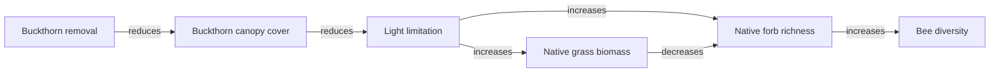

# Causal Mosaic Guide for Ecologists

## What This Schema Is For

This schema is a way to store ecological causal claims in a consistent format.

Instead of keeping a finding only as prose, like:

> Buckthorn removal increased light and improved native forb recovery.

the schema breaks that statement into reusable parts that can be searched, compared across studies, and summarized later.

## The Same Shared Example

This guide uses the same example as the other two guides:

- invasive buckthorn is removed
- buckthorn canopy cover decreases
- more light reaches the ground
- native forbs increase
- native bee diversity increases
- native grass recovery can also suppress some forbs

That example is fully represented in `sample_data.yaml`.

## The Two Main Pieces

The schema has two major parts:

- nodes: the ecological variables or processes that changed
- edges: the causal claims connecting those changes

Examples of nodes from the sample:

- increased buckthorn removal intensity
- decreased buckthorn canopy cover
- increased light availability at ground level
- increased native forb species richness
- increased native bee species richness

Examples of edges from the sample:

- buckthorn removal negatively regulates buckthorn canopy cover
- buckthorn canopy cover negatively regulates light availability
- native forb richness positively regulates bee diversity

## Why the Nodes Are Written as Changes

The schema treats ecological causation as being about changes in variables, not just things by themselves.

So instead of a node being just "buckthorn," it is something like:

- decreased buckthorn canopy cover

Instead of just "bees," it is:

- increased native bee species richness

This makes it much easier to compare claims across studies, because the same species or habitat can be involved in many different kinds of changes.

## Why Ontology Terms Are Used

The identifiers from ontologies are there to make the data more consistent.

For example, a study might say:

- canopy
- shrub canopy
- overstory cover

Those might all be treated as closely related concepts if they are grounded to the same controlled term.

You do not need to memorize ontology IDs to use the schema well. The main idea is just:

- text label for people
- stable identifier for machines

## A Simple Example

Here is one edge from the sample in compact form:

```yaml
- subject: "node:native_forb_richness"
  predicate: positively_regulates
  object: "node:bee_diversity"
  philosophical_accounts:
    - probabilistic
    - mechanistic
```

This means:

- more native forb species are linked to more native bee species
- the claim is treated partly as probabilistic because it raises the chance of higher bee diversity
- it is also mechanistic because the paper gives a biological story about nectar and pollen resources

## What the Extra Edge Fields Mean

Some edge fields are especially useful for ecologists:

- `claim_strength`: how strong the paper's causal language is
- `direction`: whether the direction of causation is actually supported
- `moderation`: whether the effect depends on context
- `strength`: whether the effect size is weak, moderate, or strong
- `evidential_basis`: what kind of evidence supports the claim

This is useful because ecological claims are often conditional.

In the shared example:

- more light can help forbs
- but stronger grass recovery can push the other way

So the schema can store both effects explicitly instead of averaging them into one vague conclusion.

## The Shared Example as a Small Causal Network



## Practical Use

You would use this schema when you want to:

- extract causal claims from papers systematically
- compare restoration pathways across studies
- build evidence maps
- support synthesis, modeling, or decision tools

The point is not to replace ecological interpretation. The point is to make ecological interpretation easier to store, compare, and reuse.
