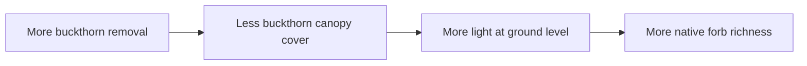
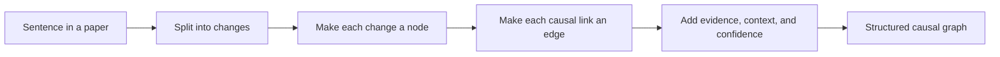

# Sentence to Schema Infographic

## The Sentence

> Removing buckthorn reduced canopy cover, which increased light, which helped native forbs recover.

## Step 1: Find the changes

Every part of the sentence that describes something changing becomes a node.



## Step 2: Turn each change into a node

| Phrase in the sentence | Node meaning |
|---|---|
| "Removing buckthorn" | increased buckthorn removal |
| "reduced canopy cover" | decreased buckthorn canopy cover |
| "increased light" | increased light availability |
| "helped native forbs recover" | increased native forb richness |

## Step 3: Add the causal links

Each "reduced," "increased," or "helped" relationship becomes an edge.

```mermaid
graph TD
  A["Node 1: increased buckthorn removal"]
  B["Node 2: decreased buckthorn canopy cover"]
  C["Node 3: increased light availability"]
  D["Node 4: increased native forb richness"]

  A -->| "negatively_regulates" | B
  B -->| "negatively_regulates" | C
  C -->| "positively_regulates" | D
```

## Step 4: Add what the paper is really claiming

The schema does not only store the link.
It also stores what kind of claim the authors are making.

For each edge, you can ask:

- Is this presented as causal, or just associated?
- Is the direction clearly supported?
- Is there a mechanism?
- What kind of evidence supports it?

## Step 5: Add confidence and evidence

For example, the edge:

> less buckthorn canopy -> more light

can also carry notes like:

- claim strength: direct causal
- philosophical account: mechanistic
- direction: asserted
- evidence type: mechanistic study + field observation
- certainty: high

## One Claim in Plain Language and Schema

### Plain language

> Less buckthorn canopy let more light reach the ground.

### Schema shape

```yaml
- subject: "node:buckthorn_canopy_cover"
  predicate: negatively_regulates
  object: "node:light_availability"
```

### What that means

- the first node is about buckthorn canopy cover
- its direction is "decreased"
- the second node is about light availability
- its direction is "increased"
- the edge says changes in canopy cover affect changes in light

## The Whole Translation at a Glance

| Ordinary sentence part | Schema role |
|---|---|
| a thing changing | node |
| a cause/effect phrase | edge |
| "more" or "less" | direction |
| "in this habitat" | context |
| "supported by experiment" | evidence |
| "strong claim" | claim strength / certainty |

## The Shortcut Version



## If You Want to Explain It Out Loud

> First, find the parts of the sentence that describe change. Those become nodes. Then find the parts that say one change affected another. Those become edges. After that, add notes about context, evidence, and confidence.

## Fill-in Version

Sentence:

> `________________________________________`

Changes:

- `________________________________________`
- `________________________________________`
- `________________________________________`

Causal links:

- `________________________________________`
- `________________________________________`

Evidence:

- `________________________________________`
